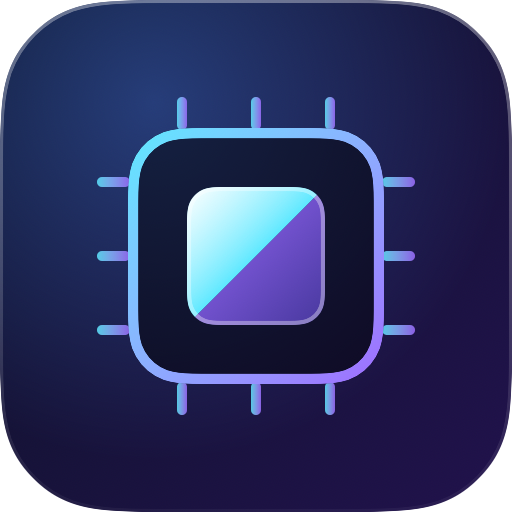

# Coremium



**Keep what matters smooth, without closing anything.**

Coremium lives in your Mac's notch. It protects the app you're using (a game, a render, a build, a local AI job) and
quietly moves everything else to the efficiency cores. Nothing is quit; the app you're using is always left at full speed.

- **Modes:** Automatic, Balanced, Gaming, Creator, Coding, Local AI. Automatic switches by itself.
- **Four choices per app:** Boost, Normal, Yield, Eco. Your choice always beats the mode.
- **Advanced mode:** per-core load %, memory, swap and pressure, process counts, PIDs, timers, and why each rule applies.
- **Storage:** see what's filling your disk (app caches, logs, Xcode build files, old downloads, the Trash) and move what you
  choose to the Trash. Read-only scan, nothing is ever deleted for good, documents are never touched.
- **Insights:** what Coremium actually did (measured), why it made each decision, and what it costs.
- **Simulate:** an animated illustration of the idea (clearly labelled as such).
- **Learns locally:** suggests "Yield" for apps that hog the CPU while you play, and "Boost" for apps you work hard in.
- **Fullscreen fix** for the macOS 27 fullscreen stutter on 120 Hz MacBooks (optional).
- Welcome tour and guide built in. Free, open source (MIT), no account, no network access.

> Not affiliated with Apple. The Apple logo on the chip is Apple's own system symbol, drawn by macOS at runtime to
> indicate Apple Silicon. Coremium doesn't ship it.

## How it works, and what it can't do

macOS lets any app lower the priority of its **own user's** processes. Processes in the *background band* are scheduled on
the **efficiency cores** with throttled disk and network I/O. That is what `taskpolicy -b` does, and what Coremium does
for you, automatically and reversibly.

**"Boost" is therefore indirect.** macOS has no public way to raise an app above normal priority or pin it to the
performance cores without root. Boosting an app means *protecting it and moving other apps aside while you use it*.

**Does it help? It depends on load.** When your Mac has more busy work than cores, background apps compete with your
game and cause hitches; moving them to the efficiency cores removes that contention. When your Mac isn't overloaded
there is nothing to fix. Coremium shows only what it can measure: how long it protected your app, how many processes it
moved, its own CPU cost, and a plain-words log of each decision. It makes no battery, temperature or speed-up claims.

**GPU.** macOS has no public way to give one app GPU priority or to slow another app's GPU work. Coremium measures
instead: device GPU load and each app's share of GPU time (read from the system registry, no admin rights), shows
"GPU heavy" on rows, and names heavy background users in its decision line. We tested whether the background priority
band reduces GPU contention with a Metal frame-loop (`bench/gpu-contention.swift`): it did not (median frame time
2.1 ms with a GPU hog at normal priority, 2.4 ms with the hog in the background band, no hitches in either), so
Coremium does not pretend it does.

Coremium does **not**: touch other users' or system processes (no root helper), control clock speed, measure power or
exact temperature (so it never claims longer battery life or lower temperature; the energy figure in Insights is a
labelled estimate), attribute helper services macOS starts for an app (e.g. Safari web content), or quit/suspend anything.
On Intel Macs there are no efficiency cores; demoted apps simply get lower priority.

## Modes

| Mode | Protected (boost) | Moved to efficiency cores during a session |
|---|---|---|
| **Automatic** | Follows the app in front, or a busy game/creator/AI app | per the profile in force |
| **Gaming** | Games | Creative tools, dev tools, browsers, chat, AI assistants |
| **Creator** | Video, audio, 3D, design, photo | Games, browsers, chat, AI assistants |
| **Coding** | Editors, terminals, builds | Games, creative tools |
| **Local AI** | LLMs, image generation, VMs | Games, creative tools, browsers, chat |
| **Balanced** | Nothing automatic | Nothing; only your per-app choices |

Per-app choices: **Boost** (protected, starts sessions), **Normal** (untouched), **Yield** (steps aside during
sessions), **Eco** (always on efficiency cores unless you're using it). A session ends 90 seconds after the boosted app
isn't in use. Finder, Dock, Music, Spotify and Coremium itself are protected.

Apps are recognised by kind (a built-in table, the category each app declares, Steam library location, and names of
common local-AI tools). Coremium reads your apps directly and watches your app folders, so it never waits on Spotlight.

## Known limitations

- Boost is indirect (see above); Coremium can't raise an app above normal priority.
- Helper services that macOS starts for an app (Safari web content, etc.) can't be attributed to it.
- No battery-life or temperature claims; it can't measure either.
- Ad-hoc signed and not notarized, so macOS asks you to approve it once.

## Tested on

| macOS | Hardware | Status |
|---|---|---|
| 27.0.1 | MacBook Pro 14", M3 Pro | Developed and tested here |
| 13 to 26, Intel, other Apple chips | | Built for these (deployment target 13.0, universal) but not tested yet. Please report. |

## Windows (beta)

A desktop version for Windows 10 and 11 lives in [`windows/`](windows/). It uses Windows efficiency mode instead of the
notch, and is a **beta**: not yet tested by hand on a Windows PC. Install it from PowerShell (checks the checksum, no
admin, no SmartScreen prompt):
`irm https://raw.githubusercontent.com/Cubinghackerz/Coremium/master/scripts/install.ps1 | iex`
or download it from the [Windows beta release](../../releases?q=windows&expanded=true).

## Install

No paid Apple developer account is needed, so the app is **ad-hoc signed, not notarized**; macOS warns the first time.

1. Download `Coremium-x.y.z.dmg` from [Releases](../../releases), open it and drag **Coremium** to Applications. Or in
   Terminal (checks the checksum, no first-launch warning):
   `curl -fsSL https://raw.githubusercontent.com/Cubinghackerz/Coremium/master/scripts/install.sh | bash`
2. Open it. If macOS can't verify it: **System Settings › Privacy & Security › "Open Anyway"**, or in Terminal:
   `xattr -dr com.apple.quarantine /Applications/Coremium.app`
3. Follow the welcome tour. Hover the notch (or click the menu-bar chip icon) to open the panel. While a game is in
   front the pill ignores the mouse so it never gets in the way; use the menu-bar icon then.

Supports **macOS 13 through 27**, Apple Silicon and Intel (universal binary). Developed and tested on macOS 27 / M3 Pro;
other versions are built against the macOS 13 target but not individually tested yet. Reports are welcome.

### If something stays slow

Quitting restores everything, as does the next launch after a crash. From Terminal:

```bash
/Applications/Coremium.app/Contents/MacOS/Coremium --restore-all
```

## The fullscreen fix

On 120 Hz ProMotion MacBooks, fullscreen Metal apps use Direct-to-Display, which breaks frame pacing; macOS 27 makes it
worse. Any other window on screen makes macOS composite normally. With the fix on, Coremium keeps a 2-pixel
always-on-top window on every display (invisible inside the notch; one dark pixel in the corner elsewhere). It ignores
clicks and never takes focus. Fullscreen video may use slightly more battery.

## Uninstall

Quit Coremium from its menu-bar icon, delete `Coremium.app`, and remove `~/Library/Application Support/Coremium`
(settings, history, crash-recovery file) and the login item in System Settings › General › Login Items if enabled.

## Build from source

```bash
brew install xcodegen
scripts/build.sh            # universal, ad-hoc signed app + zip in dist/
xcodebuild -project Coremium.xcodeproj -scheme CoremiumCore test
scripts/render-previews.sh out/   # renders every panel/tab/onboarding step to PNGs without launching the app
```

`Sources/CoremiumCore` holds all logic (process tree, priority control, rules, modes, classification, usage history,
learning, chip info) and is unit tested without launching the app. `Sources/Coremium` is the notch UI.

## License

MIT. See [LICENSE](LICENSE).
